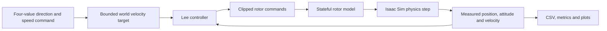

# The runtime and controller contract

## The problem this solves

Before asking a swarm to learn, we must know what an action does to one drone. A learning algorithm cannot diagnose an axis reversal, stale rotor state after reset, or a different PyTorch library being loaded than the one we intended. This increment makes those questions observable.

The [runtime guide](../docs/07-omnidrones-runtime.md) explains installation. The [control guide](../docs/08-single-drone-control.md) defines the experiment and records lab results. This document explains why the pieces are arranged this way.

## A package is not the whole simulator

Host Python 3.12 starts Docker and writes a run report. Inside Docker, NVIDIA's Python 3.10 runs Isaac Sim. These are separate processes. The shared ALiGn code is compatible with both, but a native library built for Python 3.10 cannot simply be imported by Python 3.12.

We inspected the code before lowering ALiGn's minimum Python version. The only identified Python-version API obstacle was `datetime.UTC`, replaced with `timezone.utc`. We then installed the built wheel in an isolated Python 3.10 environment and ran the CPU suite there as well as on 3.12. These checks establish ordinary package compatibility. Actual simulator execution still requires the bundled interpreter and native libraries.

A dependency lock is a list of exact packages and hashes; it does not magically describe software outside that list. Our host `uv.lock` covers host tools and optional plotting dependencies. The simulator stack combines a pinned NVIDIA image, pinned OmniDrones source, a small recorded patch, a separate lock for additional wheels, and the ALiGn wheel. The derived image's build checks that the vendor PyTorch version remains intact.

## Following one action

Suppose the command is `[1,0,0,0.5]` and the configured maximum speed is 0.5 m/s:

1. Clip each of the four action values into [-1,1]. A future policy's Gaussian sample might otherwise exceed these limits even if its mean is bounded.
2. Normalize `[1,0,0]` to a unit direction.
3. Multiply the direction by `0.5 m/s × abs(0.5)`, giving `[0.25,0,0]` m/s.
4. Give this world-frame velocity target and the measured state to the Lee controller.
5. The controller calculates four rotor thrust commands.
6. Clip those commands to the rotor interface's range, then let the rotor model update its throttle state.
7. Apply the resulting physical forces and torques, advance physics by 0.01 s, and measure the new state.

The next action uses that newly measured state. No neural network is involved yet.

The direction/speed meaning follows the submission and student's source. The low-level implementation is an adaptation: Hummingbird and its supplied Lee gains replace the student's Crazyflie/PID model. This must remain visible when we later compare experiments. It is not evidence that the two controllers or drone models are equivalent.

## World coordinates versus body coordinates

Imagine the drone turns 90 degrees about vertical. Its nose now points along a different world direction. A command in the **body** frame would turn with the drone. Our command is in the **world** frame: positive X means the same world direction before and after the turn.

The `x_yaw90` case checks this distinction. It resets the drone's yaw to 90 degrees, commands world X, and measures X displacement and unwanted Y/Z displacement. Simply checking whether the drone moved somewhere would miss a frame error.

The attitude quaternion is `[w,x,y,z]`, not `[x,y,z,w]`. For a 90-degree yaw, it is approximately `[0.7071,0,0,0.7071]`. The identity quaternion is `[1,0,0,0]`. Mixing those orders can produce a finite but wrong orientation; finite-number checks alone are insufficient.

The probe reads all state needed to instrument the controller. This is not the future decentralized actor's observation. Local-neighbor rules and target sensing still need their own contract.

## A controller and a rotor have different memory

The Lee controller here has fixed gains and no integral accumulator. Its output depends on the current measured state and target. The rotor model does remember its previous throttle: each update moves partway toward the requested throttle.

Moving the visible drone back to the start therefore does not fully reset an episode. We must reset pose, linear/angular velocity, rotor throttle, joint position/velocity, and relevant force buffers. The test reuses the existing drone instance. After completing several different cases, it repeats the same cases and compares entire state/action trajectories. This can expose memory leaking from the previous flight.

Repeated trajectories are a practical diagnostic, not a proof of complete simulator serialization. PhysX has internal state beyond what this probe records. Future training recovery must separately distinguish restoring the learning state from restoring an exact physical trajectory.

## Why the timestep is part of the model

At 100 Hz, 100 physics steps represent one simulated second. Wall-clock time can be shorter or longer depending on startup, GPU execution, Python overhead, and logging.

The pinned rotor code uses a throttle interpolation factor of 0.43 per update. It is not a time constant expressed in seconds. Running that same update at 50 Hz changes its effective response per second. Consequently changing a timestep is an experimental change, even if every gain and high-level command is identical.

This first probe uses one controller call for every physics step. Later, a slower policy could hold its command for several physics steps, but that policy frequency and the controller frequency must be stated separately.

## How to read acceptance evidence

The hover case starts slightly away from the target. Returning close to the target tests recovery, while a zero-motion hover initialized exactly at equilibrium would be weaker evidence. The velocity cases check direction, displacement, speed tracking, unwanted cross-axis movement, and braking. The reset repetition checks compare positions, velocities, attitudes, angular rates, rotor commands, and rotor state.

Thresholds start as calibration values. We inspect actual trajectories, diagnose failures, then freeze the acceptance settings and collect a new run. Keeping failed runs prevents a later reader from confusing successful debugging with a result that worked on the first attempt.

The CPU tests use analytical sample tables to check whether the reporting code detects known defects. Those tables are not flight evidence. The lab run must create a drone and advance actual physics. A zero container exit without complete metrics is also insufficient: fast shutdown may exit directly, so data must be flushed before it is called.

## Code map

| File | Responsibility |
|---|---|
| `runtime/stack.json`, `runtime/additions.lock` | Exact stack selection and additional package hashes |
| `runtime/Dockerfile`, `runtime/verify_stack.py` | Offline derived-image installation and dependency checks |
| `src/align/runtime/drone_runtime.py` | Host build/launch orchestration and run identity |
| `src/align/simulation/contract.py` | CPU-only configuration, action mapping, and metric decisions |
| `src/align/simulation/single_drone.py` | Actual simulator/controller loop and saved measurements |
| `src/align/simulation/report.py` | Recompute metrics and plots from saved data |
| `tests/test_drone_contract.py` | Analytical checks that reject wrong axes, incomplete data, and reset leakage |

## Boundaries of this evidence

A passing single-drone check supports the tested controller/model combination at the recorded timestep and modest speed. It does not establish ground takeoff, inter-drone safety, actor locality, recurrent training, formation construction, or correspondence to the paper's reported numbers. Its purpose is to provide a dependable physical interface for those next components.

## What the first lab failure taught us

A USD file can exist locally while still referring to a remote appearance material. The first run created the drone but rejected an unresolved online plastic shader before advancing physics. We preserve this failure. The retry makes an explicit untextured copy, verifies nonmaterial properties are unchanged, and records both asset hashes. Appearance and physical properties are separate concerns, but both must be accounted for when claiming an offline, reproducible runtime.

## What the calibration trajectory shows

The real drone recovered from its hover offset and moved on each requested axis, including world X after a 90-degree yaw reset. During a 0.25 m/s command it settled near 0.229 m/s. Its low-level velocity gain and physical damping explain this steady error approximately: the gain pushes toward the target while damping opposes motion. A stateless proportional velocity controller need not eliminate steady error. We record and bound that error rather than calling the target and measured velocity identical.

The calibration flight itself completed, but PDF export failed because the vendor image's matplotlib lacked fontTools. This distinguishes a physical experiment from a complete usable result bundle. We added that dependency explicitly and preserved the failed attempt. We also corrected root-container JSON permissions so the host can inspect the completed records.

The subsequent acceptance run used the tighter thresholds frozen from calibration. It passed all 62 decisions, saved both plot formats, exited the container successfully, and passed an independent host recomputation from the raw trajectory. That closes the one-drone physical-interface question for the tested model, controller, timestep, and command range. It does not answer multi-drone safety or formation-control questions; those require separate evidence.
