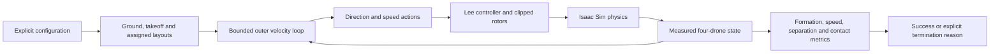

# Ground-to-formation construction

## What problem this solves

A list of target points does not make a formation task. Drones need identities, safe starting positions, paths to their assigned slots, a rule for deciding when they are finished, and reasons for stopping when something goes wrong.

The [multi-drone operations guide](../docs/10-multi-drone-construction.md) describes the runnable probe. This page explains why its sequence and measurements exist.

## One group with stable identities

The first physical group contains four agents:

```text
group 0: [agent 0, agent 1, agent 2, agent 3]
```

Their IDs persist through reset, takeoff, assignment, trajectory rows, and metrics. “Agent 2 reached its slot” therefore means the same drone throughout the episode.

The drones begin in a line:

```text
x = -1.5, -0.5, 0.5, 1.5 metres
y = 0
```

The final plane is a square. The Hungarian algorithm chooses one distinct slot for each identity once. Keeping that mapping fixed prevents nearby drones from exchanging goals whenever their distances happen to cross.

## Why takeoff and rearrangement are separate

Sending each drone directly from the ground to a three-dimensional target mixes two questions: can it lift safely, and can the group rearrange safely? A failure would be difficult to diagnose.

The probe first gives every drone a target directly above its ground position at 1.5 m. Only after the takeoff interval does it switch to the assigned plane slot. This staged path is simple enough to inspect:

```text
ground line -> elevated line -> plane formation
```

The path is still controlled by physics. The stages specify targets rather than teleporting drones after reset.

## From position error to the validated action

The accepted one-drone interface expects direction plus speed scale. Formation construction naturally starts from position error:

```text
error = target position - current position
desired velocity = gain × error
```

If the desired velocity is faster than 0.5 m/s, its whole vector is scaled down while preserving direction. A command of `(0.3, 0.4, 0)` already has norm 0.5, so it becomes:

```text
direction = (0.6, 0.8, 0)
speed scale = 1.0
```

Decoding that four-value action returns the same world velocity. The Lee controller translates it into four bounded rotor commands. This outer loop is a deterministic construction controller used to validate the task; it is not the future actor policy.

## Contact and separation answer different questions

A contact sensor reports force on a drone body. Pairwise geometry reports center-to-center distance.

- Two drones can violate a conservative separation threshold without touching.
- A drone can contact the ground while remaining far from every other drone.
- During the initial ground segment, ground contact is expected evidence.
- After takeoff, physical contact is a failure even if sampled center distance did not cross its threshold.

The probe therefore records both. It labels `separation_violation` and `airborne_contact` separately instead of treating one as a substitute for the other.

The current contact measurement is a net base-link force. It says a contact occurred but does not identify whether the collider was another drone or the ground. Altitude makes initial ground contact distinguishable; future obstacle tasks will need richer attribution.

## Why success requires dwell

A drone can pass through a target at high speed. Declaring success from one close sample would reward a fly-by.

For two continuous seconds, the probe requires:

- low assigned-target RMSE;
- low pairwise shape RMSE;
- low maximum drone speed;
- safe pair separation;
- no airborne contact.

If any condition becomes false, the dwell counter returns to zero. Completion time is the first step that finishes this uninterrupted interval.

## Reset memory across four drones

Resetting visible poses is insufficient because every rotor has throttle state and joint state. Four drones have sixteen such rotor states. The probe reuses the same simulator objects and restores:

- world positions and identity quaternions;
- linear and angular velocities;
- rotor throttle;
- rotor joint positions and velocities;
- force buffers and deterministic seeds.

It then repeats the complete task and compares trajectories. This can expose memory leakage, although it does not claim exact serialization of every hidden PhysX state.

## Data flow



## What will establish that it works

CPU tests already establish schedule boundaries, layout spacing, action round trips, metric aggregation, distinct safety failures, dwell evaluation, and reset comparison logic.

The lab run must additionally show that four actual Hummingbirds are created; ground contact is observed; they rise on the correct axes; all observations and actions stay finite; the assigned plane is reached and held; separation remains safe; no airborne contact occurs; repeated trajectories agree; both plots are saved; host recomputation matches; and the container exits successfully.

The first lab run became the calibration record. Both physical episodes reached success, but offline evaluation exposed two reporting issues: comparisons tighter than float32 serialization and a single tolerance mixing physical units. The raw CSV made both defects recoverable without rerunning physics.

The corrected evaluator uses a small `1e-6` tolerance only when checking whether serialized targets/actions match their configured values. Repeatability is now reported separately for position, velocity, attitude, angular rate, actuators, and rotor state. Ground-contact angular rate was the largest variation; airborne formation behavior was much closer.

The original run remains failed. A separate derived report demonstrates that its raw trajectory satisfies the corrected rules, and its measurements define the frozen schema-2 configuration. Clean run `20260916T121136.980227IST-48963b76` then passed inside the simulator and on host recomputation, closing the physical construction check without rewriting the calibration history.
